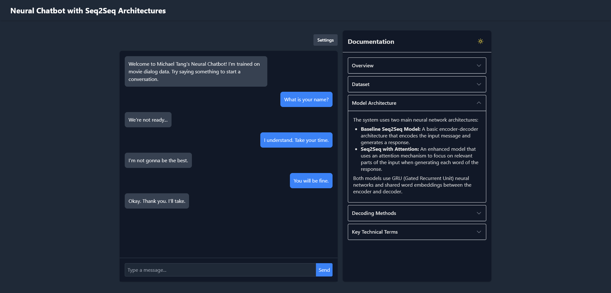

# Neural Chatbot Web Interface

 The web interface provides an intuitive way to test and experiment with different model configurations and decoding strategies, allowing users to understand the strengths and limitations of each approach.



## Project Structure

```
seq2seq-chatbot/
├── models/                  # Trained model files
│   └── attention_model.pt   
│   └── baseline_model.pt    
├── static/                  # Static web assets
│   └── styles.css           # CSS stylesheet
│   └── chat.js              # JS chat interface
│   └── example.png          # README example
├── templates/               # HTML templates
│   └── index.html           # Main application template
├── app.py                   # Flask application for serving the UI
├── chatbot_models.py        # Class functions and definitions
├── postprocessing.py        # Functions for cleaning and formatting responses
├── processed_CMDC.pkl       # Processed Cornell Movie Dialog Corpus data
├── README.md                # This file
└── requirements.txt         # Required dependencies
```

## Requirements

- Python 3.7 or higher
- PyTorch 1.7 or higher
- Flask
- Flask-CORS
- TQDM
- Pickle

## Installation

1. Clone this repository:
   ```
   git clone <repository_url>
   cd seq2seq-chatbot
   ```

2. Install the required Python packages:
   ```
   pip install -r requirements.txt
   ```

3. Make sure you have the trained models and dataset:
   - `baseline_model.pt`
   - `attention_model.pt`
   - `processed_CMDC.pkl`

## Running the Application

1. Start the Flask server:
   ```
   python app.py
   ```

2. Open your web browser and navigate to:
   ```
   http://localhost:5000
   ```

## Features

- Interactive chat interface for conversing with the neural chatbot
- Choice between two model architectures:
  - Baseline Seq2Seq model
  - Seq2Seq with Attention mechanism
- Three decoding methods:
  - Greedy search: always selects the most probable next word
  - Top-p sampling: samples from the most probable words based on a probability threshold
  - Beam search: maintains multiple candidate sequences and selects the most probable
- Configurable parameters:
  - Temperature for controlling randomness in top-p sampling
  - Top-p threshold value
  - Beam size for beam search
- Comprehensive documentation explaining the models and concepts

## Models

### Baseline Seq2Seq

The baseline model is a standard sequence-to-sequence model with:
- Shared word embeddings (300 dimensions)
- Bidirectional GRU encoder (2 layers)
- Unidirectional GRU decoder (2 layers)
- Simple encoder-to-decoder hidden state transfer

### Seq2Seq with Attention

The attention model extends the baseline with an attention mechanism that allows the decoder to focus on different parts of the input when generating each word of the output. This typically results in better responses, especially for longer inputs.

## Decoding Methods

### Greedy Search

At each step, the model selects the most probable next word. This produces consistent but sometimes repetitive or dull responses.

### Top-p Sampling (Nucleus Sampling)

The model samples from the most probable words that together reach a cumulative probability of p. This creates more diverse and natural-sounding responses.

Parameters:
- **Temperature**: Controls randomness - higher values (>1) increase diversity, lower values (<1) make responses more focused
- **Top-p**: Controls how much of the probability distribution to consider - lower values focus on only the most likely words

### Beam Search

The model keeps track of the k most probable sequences at each step. This creates more globally coherent responses by considering multiple possibilities in parallel.

Parameters:
- **Beam Size**: Controls how many candidate sequences are maintained - larger values explore more possibilities

## Dataset

The chatbot is trained on the Cornell Movie Dialog Corpus, which contains conversations extracted from movie scripts. The dataset includes over 220,000 conversational exchanges between more than 10,000 pairs of movie characters.

For this implementation, we're using a filtered subset of single-turn conversations (one message and one response) with at least 10 tokens each to ensure meaningful exchanges.

## Customization

- Modify `templates/index.html` to change the user interface
- Edit `app.py` to adjust server behavior or add new features
- Update the neural models in the original implementation file

## Troubleshooting

- If you encounter GPU memory issues, try running with CPU only by modifying the device selection in `app.py`
- If models fail to load, ensure the paths to model files are correct
- Check the console for detailed error messages

## Credits

- Original implementation: CS4650 Natural Language Processing Course Project
- Cornell Movie Dialog Corpus: Cristian Danescu-Niculescu-Mizil and Lillian Lee
- Interface design: Michael Tang
